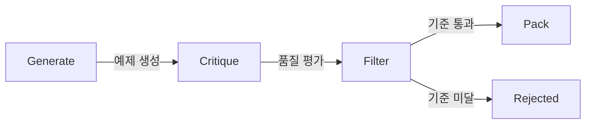

# Pipeline Module

4단계 파이프라인: **Generate → Critique → Filter → Pack**

---

## 진입점

- **Core**: [four_stage_pipeline.py](four_stage_pipeline.py)
- **Orchestration**: [orchestrator.py](orchestrator.py)
- **YAML Runner**: [yaml_runner.py](yaml_runner.py)

---

## 4단계 흐름



| 단계 | 역할 | 출력 |
|------|------|------|
| **Generate** | LLM으로 학습 예제 생성 | `GeneratedExample` |
| **Critique** | Teacher 모델로 품질 평가 | `CritiqueResult` |
| **Filter** | 기준 미달 제외 | Filtered examples |
| **Pack** | YAML/JSON 출력 | Training data |

---

## 핵심 Pydantic 모델

### PipelineConfig

```python
@dataclass
class PipelineConfig:
    max_tokens_input: int = 8000
    max_tokens_output: int = 2048
    temperature: float = 0.7
    max_retries: int = 2
    batch_size: int = 50
    enable_korean_checks: bool = True
    korean_constraints: List[KoreanConstraint] = None
```

### GeneratedExample

```python
class GeneratedExample(BaseModel):
    id: str
    task_type: TaskType        # summarize, extract, analyze, qa, reasoning
    domain_type: DomainType    # insurance, legal, medical, financial
    instruction: str
    input_text: str
    output_text: str
    context_items: List[ContextItem]
    metadata: dict
```

### CritiqueResult

```python
class CritiqueResult(BaseModel):
    example_id: str
    coherence: float      # 1-10
    accuracy: float       # 1-10
    fluency: float        # 1-10
    korean_quality: float # 1-10
    overall_score: float  # 가중 평균
    constraint_violations: List[str]
    suggestions: str
```

### FilterCriteria

```python
class FilterCriteria(BaseModel):
    min_overall_score: float = 7.0
    min_korean_quality: float = 6.0
    max_constraint_violations: int = 2
    must_pass_korean_checks: bool = True
    allow_duplicate_content: bool = False
```

---

## 서브모듈

| 디렉토리 | 역할 |
|----------|------|
| `parsers/` | 문서 파싱 (PDF, HWP, OCR) |
| `qa/` | QA 생성/검증 |
| `quality/` | 품질 검사 |
| `converters/` | 포맷 변환 |
| `ocr/` | OCR 처리 |
| `rag/` | RAG 지원 |
| `security/` | 보안 검사 |
| `deduplication/` | 중복 제거 |
| `triage/` | 트리아지 |

---

## 실행 예시

```python
from src.pipeline.four_stage_pipeline import FourStagePipeline, PipelineConfig

config = PipelineConfig(batch_size=100, enable_korean_checks=True)
pipeline = FourStagePipeline(config)

results = await pipeline.run(
    instructions=["보험약관을 요약하세요"],
    contexts=[[ContextItem(content="...")]]
    task_type=TaskType.SUMMARIZE,
    domain_type=DomainType.INSURANCE,
)
```

---

## Troubleshooting

운영 중 문제 발생 시: **[SOLUTIONS.md](SOLUTIONS.md)**

파이프라인 관련 주요 이슈:
- GPU Segfault → `CUDA_DEVICE_MAX_CONNECTIONS=1`
- OOM → `oom_score_adj: 500`
- Redis AOF 손상 → `redis-check-aof --fix`

전체 솔루션: [docs/SOLUTIONS.md](../../docs/SOLUTIONS.md)

---

**업데이트**: 2026-01-18
